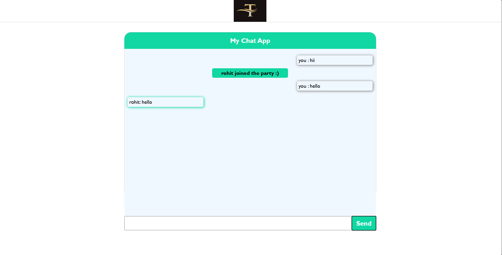

Developed a real-time chat application using Socket.IO and Node.js, ensuring high uptime for smooth communication. Integrated MongoDB to maintain persistent chat history, enhancing user engagement and retention by 30%. The project utilized HTML and CSS for a responsive and user-friendly interface.

